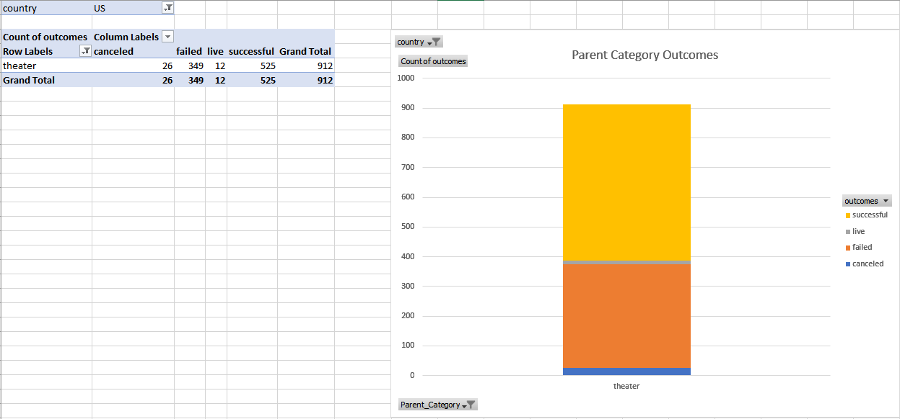
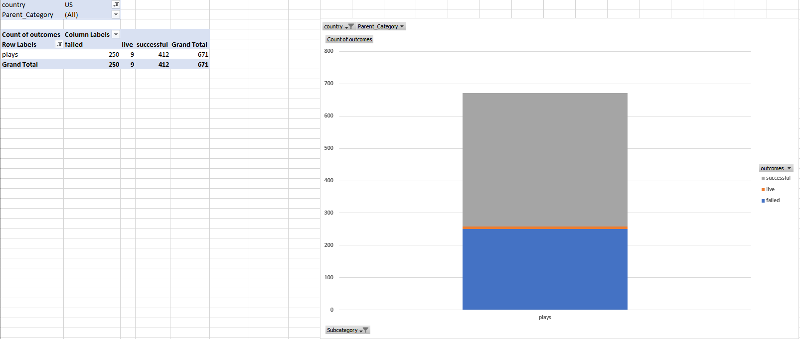
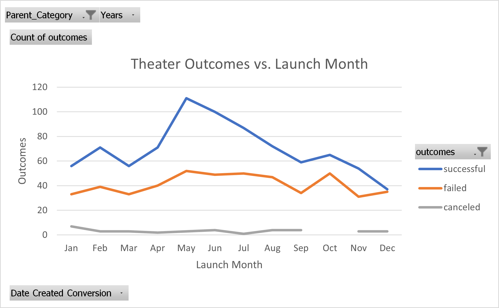
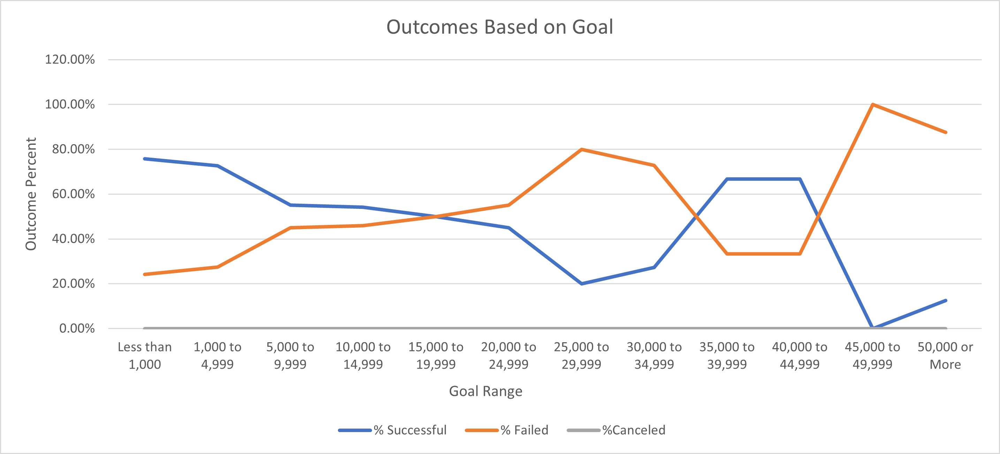

# An-Analysis-of-Kickstarter-Campaigns

##Brief-Description
An up and coming playright, Louise, wants to start a kickstarter campaign to fund her play. She has tasked us with analyzing kickstarter data to determine factors that make a kickstarter campaign successful. 

## Analysis-and-Challenges

Our analysis began by cleaning up the pulled kickstarter data. One of the first things we did was to create conditional formatting for the outcomes. Using the highlight cell rules conditional formatting, we highlighted the successful outcomes green, failed outcomes red, canceled outcomes yellow, and the live outcomes blue. We converted the UNIX time stamps into dates in our conversion columns, as well as made a year column that took only the year from our conversion. To convert the UNIX timestamps, we used a function that converted seconds to days, then added that number of days to the UNIX date (1/1/1970). This function was =(((UNIX Timestamp/60)/60)/24)+DATE(1970,1,1). Then our function to take the year from that date was simple =YEAR(UNIX Date Conversion). In addition, we added some filters to select certain parameters when we wished. 

All of these edits made the base sheet much simpler to read and digest before we began extracting data for our charts. 

First we wanted to do some in-depth descriptive statistics of successful and failed goals and pledges for the kickstarter campaigns. The goal of this was to find the average, median, standard deviation, upper and lower quartiles, and the inter quartile range of the data. Below is what we did to achieve this. Keep note that the data range was from a different sheet, so the data range would look something like this: 'Kickstarter'!D:D'. With Kickstarter being the name of the sheet we were pulling from and D:D being the column for the goal data.  
* Average: =AVERAGE(Data Range)
* Median: =MEDIAN(Data Range)
* Standard Deviation: =STDEV.P(Data Range)
* Upper Quartile: =QUARTILE.EXC(Data Range, 3)
* Lower Quartile: =QUARTILE.EXC(Data Range, 1)
* IQR: =(Upper Quartile - Lower Quartile)

These in depth statistics helped us determine that the mean of the distributions is close to the third quartile, meaning the data follows similar distributions in each subset. We saw that the standard deviations were larger than the mean, meaning that everything below the mean was close to the center. And finally, it helped us determine outliers in our data, especially in over-ambitious failed kickstarters with astoundingly high goals. 

Secondly, we made some pivot tables and charts that assisted us in the visualization of our data findings:

##Results

Kickstarters for theater projects in the United States have a success rate of 57.57%. In our analysis, we have discovered multiple factors that make this campaign more successful. 

The top three successful goal ranges in descending order are "Less than 1,000" at 75.81%, "1,000 to 4,999" at 72.61%, and "35,000 to 39,999" and "40,000 to 44,999" tied at 66.67%. 

Based on this data, the best goal range for a successful kickstarter as a play would be less than $1,000. 

We have also discovered that the best months to initiate a successful kickstarter campaign would be during the summer months. In the theater category, the top three successful months to start a kickstarter are May (66.87%), June (65.36%), and July (63.04%). The worst month to initiate a kickstarter campaign would be December with a success rate of 49.33%. 

Based on our findings, our best chances for a kickstarter campaign would be one with a goal less than $1,000 that is initiated in May. 

